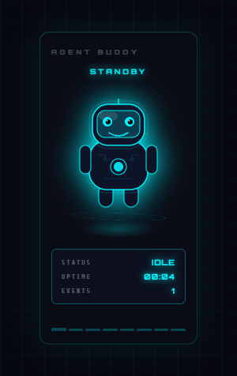
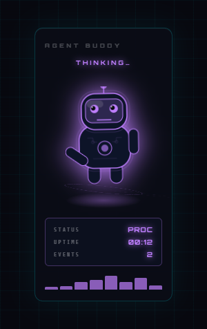
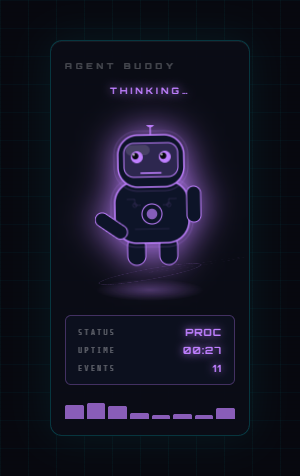
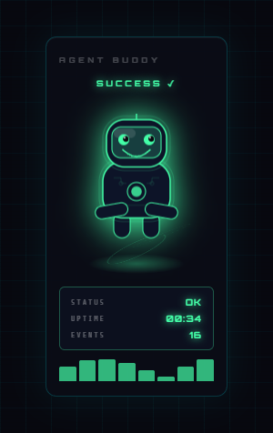
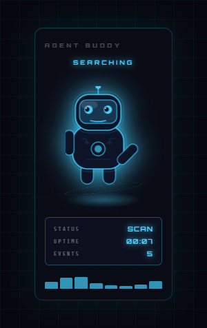
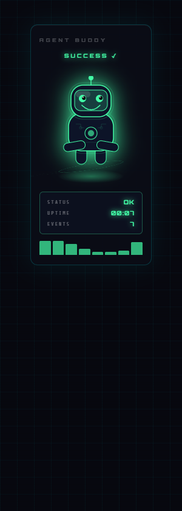
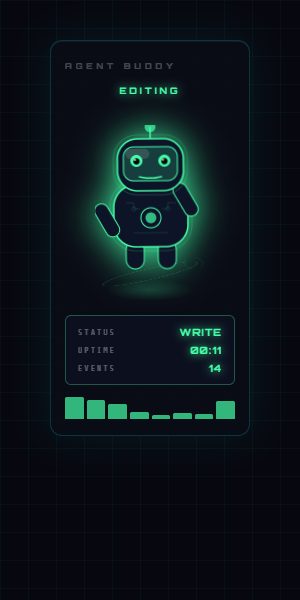
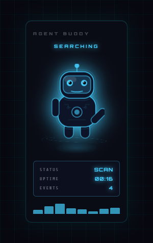
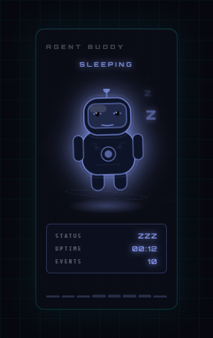

# Agent Buddy — VS Code Extension

An animated holographic AI companion that lives in your sidebar and reacts to your coding agent's activity in real time. Watch your AI assistant's personality unfold as it responds to every action in your editor.

## ✨ Features

- 🤖 **Fully Animated SVG Character** — A living, breathing AI companion with a glowing synthwave aesthetic
- 🎨 **Color-Coded Emotions** — 9 distinct visual states that react to different coding scenarios
- ⚡ **Particle Effects** — Dynamic burst animations on success and error events
- 📊 **Live Activity Tracking** — Real-time activity bars and uptime monitor
- 😴 **Smart Sleep Mode** — Auto-sleeps after 4 minutes of inactivity to save resources
- 🖱️ **Interactive Demo** — Click the character to cycle through all stages and animations
- 🎭 **Multi-Stage Awareness** — Responds to editor saves, terminal activity, debugging, file navigation, and error detection

## 🎯 What Agent Buddy Does

Agent Buddy monitors your VS Code environment and displays your AI assistant's "mood" based on what's happening:

| Stage | Emoji | Color | What It Means |
|-------|-------|-------|---------------|
| **IDLE** | 😐 | Cyan | Relaxed, waiting for activity |
| **THINKING** | 🤔 | Violet | Processing after a save or API call |
| **PLANNING** | 🗺️ | Amber | In planning mode during debugging |
| **SEARCHING** | 🔍 | Sky Blue | Searching through your codebase |
| **EDITING** | ✏️ | Mint | Making active edits |
| **TERMINAL** | 📟 | Gold | Running terminal commands |
| **SUCCESS** | ✅ | Green | Hard work paid off! |
| **ERROR** | ❌ | Red | Something went wrong |
| **SLEEPING** | 😴 | Slate | Taking a power nap |

## 📸 Screenshots

The Agent Buddy displays all 9 distinct emotional states in response to your coding activity:

### Core States
  
*Default state: Relaxed and waiting for activity*

  
*Processing mode: Active after saves or API calls*

  
*In the zone: Actively making code edits*

### Activity States
  
*Engaged: Executing terminal commands*

  
*Focused: Navigating through your codebase*

### Feedback States
  
*Celebration: Code executed successfully!*

  
*Alert: Errors detected in your editor*

### Special States
  
*Strategic: In planning mode during debugging*

  
*Rest mode: Taking a power nap after inactivity*

## ⚙️ System Requirements

- **VS Code** 1.90.0 or higher

## 🤝 Contributing

Contributions are welcome! Feel free to:
- Report bugs or suggest features via [GitHub Issues](https://github.com/dooougs/AgentBuddy/issues)
- Submit pull requests for improvements
- Share your animation ideas

## 📝 License

MIT License — See LICENSE file for details

## 🎓 About

Agent Buddy was created to make AI-assisted coding more engaging and intuitive. Your AI companion shouldn't be invisible—it should be present, responsive, and fun to work with.

Made with ❤️ for developers who code with AI
